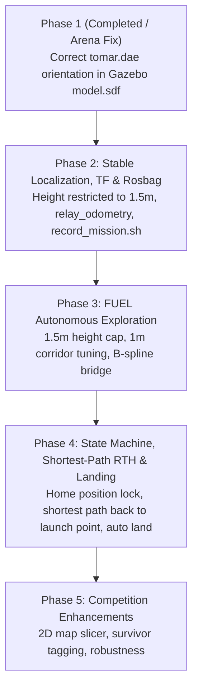

# Implementation Plan — NIDAR AirMouse Autonomous Indoor Exploration (Approved & Updated)

This implementation plan defines the phase-wise execution roadmap for the **NIDAR AirMouse** autonomous UAV project in a GPS-denied indoor environment, incorporating user requirements and feedback.

---

## Key Technical Requirements & User Directives

1. **Competition Arena Mesh Fix (`tomar.dae`)**:
   - **Immediate Task**: Fix the orientation of `tomar.dae` inside `simulation/custom_models/nidar_arena/model.sdf`. Because `tomar.dae` has `<up_axis>Y_UP</up_axis>`, Gazebo (`Z_UP`) spawns it inverted. Applying roll/pitch orientation correction (`<pose>0 0 0 1.5707963 0 0` or `3.1415926 0 0` offset) will render the arena right-side up at ground level $Z=0$.

2. **Height Restriction**:
   - **Operational Altitude**: Restrict flight and mapping altitude strictly to **1.5 meters** maximum ($Z = 1.5\text{m}$) across all phases to guarantee safe overhead clearance under low indoor ceilings.

3. **Launch Configuration**:
   - Drone launches in front of the arena using configurable spawn parameters (`SPAWN_X`, `SPAWN_Y`, `SPAWN_Z`, `SPAWN_YAW`) in `scripts/test_takeoff.sh`.

4. **Shortest Path Return-To-Home (RTH)**:
   - RTH in Phase 4 must compute the **shortest collision-free path** back to the starting launch coordinates $(X_0, Y_0, 1.5\text{m})$ using FUEL's path planning engine.

5. **Verification Standard**:
   - Validate visually in both **Gazebo Classic GUI** and **RViz**.
   - Document verification by checking `rostopic` status, rates (`rostopic hz`), and sample outputs for all key topics.

---

## Updated Phase Execution Roadmap

---

### Step 1: Arena Mesh Orientation Correction (`tomar.dae`)

#### Proposed Changes:
1. **[MODIFY] [model.sdf](file:///home/ayush/Desktop/NIDAR/simulation/custom_models/nidar_arena/model.sdf)**
   - Update `<pose>` tag for `<visual>` and `<collision>` elements to correct the `Y_UP` to `Z_UP` rotation offset so `tomar.dae` sits right-side up on ground $Z=0$.
2. **[MODIFY] [nidar_competition.world](file:///home/ayush/Desktop/NIDAR/nidar_competition.world)**
   - Verify ground plane and default spawn position in front of the arena.

#### Verification Steps:
- Execute `scripts/test_takeoff.sh true`.
- Confirm in Gazebo GUI and RViz that `nidar_arena` is oriented right-side up.
- Log `rostopic hz /velodyne_points` and `rostopic hz /mavros/imu/data`.

---

### Phase 2: Height-Restricted Localization (1.5m), TF Validation & Rosbag Logging

#### Proposed Changes:
1. **[MODIFY] [test_takeoff.sh](file:///home/ayush/Desktop/NIDAR/scripts/test_takeoff.sh)**
   - Enforce takeoff target altitude strictly to **1.5 meters**.
2. **[NEW] [record_mission.sh](file:///home/ayush/Desktop/NIDAR/scripts/record_mission.sh)**
   - Record essential mission topics (`/Fast_LIO/odometry`, `/cloud_registered`, `/mavros/local_position/pose`, `/tf`, `/tf_static`, `/mavros/state`, `/mavros/setpoint_raw/local`).

#### Verification Steps:
- Verify TF tree continuity (`camera_init` -> `body` / `base_link` -> `velodyne_link`).
- Confirm position hold at $Z = 1.5\text{m} \pm 0.05\text{m}$.
- Document `rostopic echo /mavros/local_position/pose -n 1` to verify locked altitude.

---

### Phase 3: Height-Restricted FUEL Autonomous Exploration (1.5m Altitude Cap)

#### Proposed Changes:
1. **[MODIFY] [exploration_planner.yaml](file:///home/ayush/Desktop/NIDAR/config/fuel/exploration_planner.yaml)**
   - Cap exploration Z bounds: `box_min_z = 0.5`, `box_max_z = 1.8`, setpoint altitude fixed to **1.5m**.
   - Set safety clearance $d_{\text{min}} = 0.25\text{m}$, max velocity $v_{\max} = 1.0\text{ m/s}$.
2. **[MODIFY] [fuel_to_mavros_bridge.py](file:///home/ayush/Desktop/NIDAR/scripts/fuel_to_mavros_bridge.py)**
   - Clamp trajectory Z commands to $1.5\text{m}$ max altitude.

#### Verification Steps:
- Execute full exploration test in Gazebo & RViz.
- Document `rostopic hz /planning/pos_cmd` and `rostopic hz /mavros/setpoint_raw/local`.

---

### Phase 4: State Machine, Shortest-Path RTH & Precision Landing

#### Proposed Changes:
1. **[MODIFY] [mission_manager.py](file:///home/ayush/Desktop/NIDAR/scripts/mission_manager.py)**
   - Store starting spawn position $(X_0, Y_0, 1.5\text{m})$.
   - Implement **shortest path RTH**: Upon exploration completion ($N_{\text{frontiers}} = 0$ or timeout), send $(X_0, Y_0, 1.5\text{m})$ goal to FUEL B-spline planner to compute the shortest collision-free path back.
   - Execute `AUTO.LAND` upon arrival within $0.4\text{m}$ of $(X_0, Y_0)$.

#### Verification Steps:
- Run end-to-end mission loop: Launch in front of arena -> Explore maze -> Shortest path RTH -> Touchdown landing.
- Document topic logs and telemetry timestamps.

---

### Phase 5: Competition Enhancements & Perception Integration

#### Proposed Changes:
1. **[NEW] [map_2d_slicer_node.py](file:///home/ayush/Desktop/NIDAR/scripts/map_2d_slicer_node.py)**
   - Slice point cloud between $Z = 0.3\text{m}$ and $Z = 1.8\text{m}$, publish 2D `OccupancyGrid` (`/map_2d`).
2. **[NEW] [survivor_detector_node.py](file:///home/ayush/Desktop/NIDAR/scripts/survivor_detector_node.py)**
   - Publish survivor 3D positions as `visualization_msgs/MarkerArray` on `/map_2d`.

---

## Verification Strategy

1. **Gazebo & RViz Visual Check**: Confirm visual alignment in both renderers.
2. **Rostopic Verification**: Document topic presence, rates (`rostopic hz`), and sample outputs.
